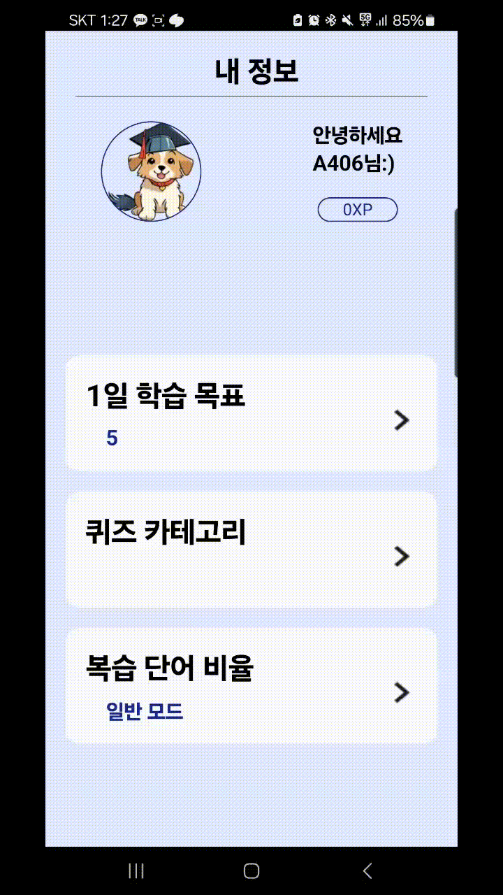
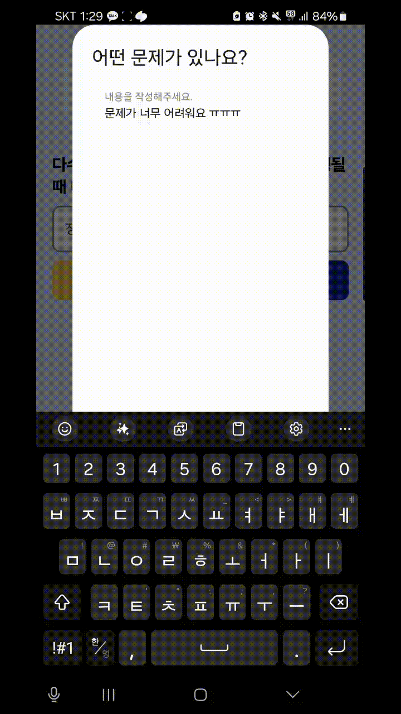
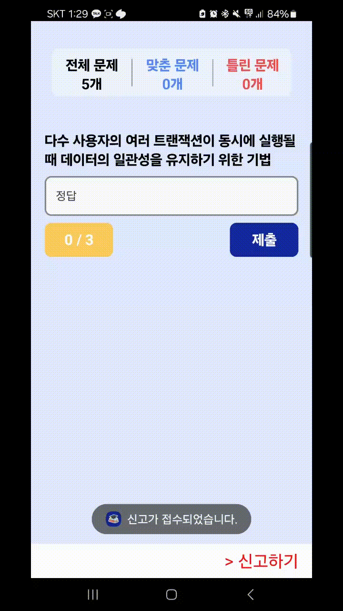
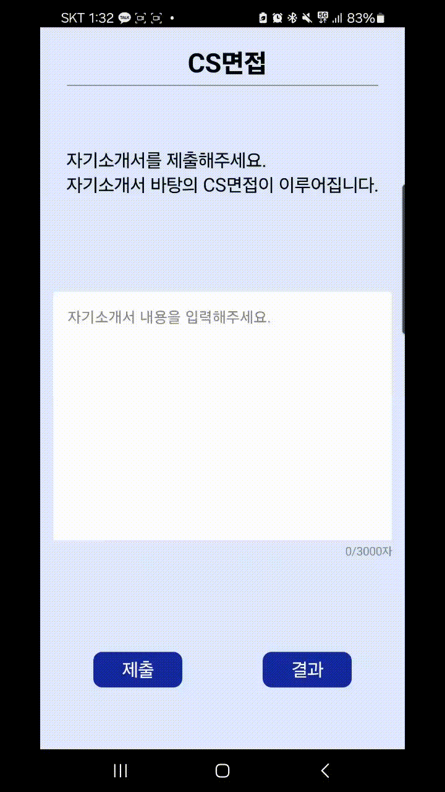
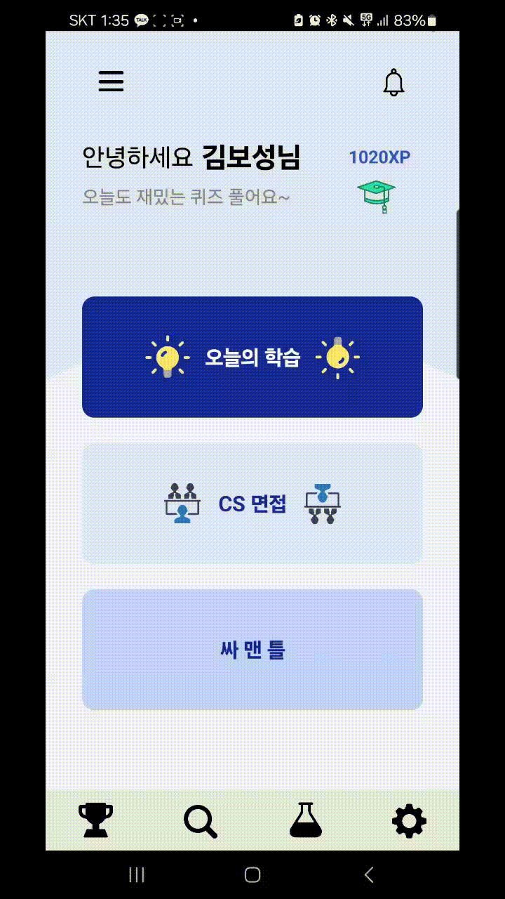
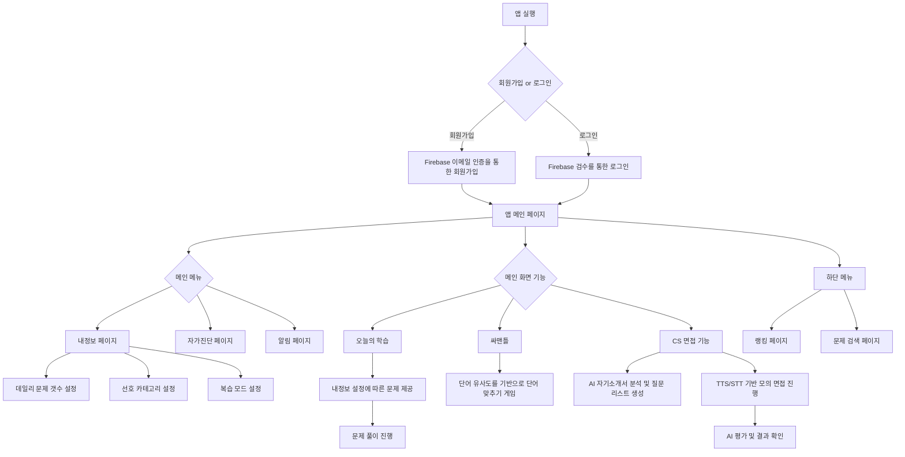

# PaceMaker - Application
PaceMaker는 Helper에서 제공하는 다양한 기능을 포함한 안드로이드 앱입니다. 기본적으로 Firebase를 통한 이메일 인증 회원관리를 제공하며 CS(Computer Science)와 관련된 기술 면접을 준비할 수 있는 애플리케이션입니다. FCM(Firebase Cloud Messaging), FastAPI, Naver Clova X, Open AI API 등을 활용하여 데일리 문제를 풀 수 있도록 제공하며 AI면접관과 함께하는 모의 면접 기능을 제공합니다. 또한, 사용자의 Pace Making을 도울 수 있도록 하며 전반적으로 사용자에게 편리한 UI/UX를 제공합니다.

## 소개


- CS공부가 부족하신가요 ?
- 기술 면접이 두려우신가요 ?
- 당신의 Pace대로 함께하겠습니다.
- Pace Maker

## 기능

### 회원가입
|  | 이메일 인증 하나로 회원 등록이 가능하며 Firebase를 통해 안전하게 관리됩니다. |
|------------------------------------------|------------------------------------------------------------------------|


### Pace Making
|  |  |  | 사용자마다 학습량, 선호 카테고리, 복습 모드를 설정하여 본인의 페이스에 맞게 학습을 진행할 수 있도록 돕습니다. |
|------------------------------------------------|------------------------------------------------|------------------------------------------------|--------------------------------------------------------------------------------------------|


### 레벨 테스트
|  | 또한, 사용자마다 수준을 고려하여 문제를 풀 수 있도록 하기 위해 자가진단 페이지를 통해 레벨 테스트를 진행할 수 있도록 제공합니다. |
|------------------------------------------------|-----------------------------------------------------------------------------------------------------------------------------|


### 데일리 문제 풀이
|  |  | 본인의 페이스대로 매일 문제를 풀 수 있게 데일리 문제 풀이를 제공하며 사용자가 최대한 문제를 맞추며 학습할 수 있도록 힌트를 제공합니다. 또한, 잘못된 문제나 오류에 대해 신고를 통해 문제를 수정할 수 있도록 제공합니다. |
|------------------------------------------------|------------------------------------------------|-----------------------------------------------------------------------------------------------------------------------------|


### 싸맨틀
|  | 공부에 지친 학습자가 조금 더 재밌게 학습할 수 있도록 게이미피케이션을 적용해 단어 유사도를 측정하여 맞출 수 있는 게임을 제공합니다. |
|------------------------------------------------|-----------------------------------------------------------------------------------------------------------------------------|


### AI CS 모의 면접
|  |  | 본인의 자기소개서를 제출하여 AI가 분석하고 예상되는 CS 면접 질문을 구성하여 모의로 면접을 진행합니다. 네이버 Clova TTS와 STT를 사용하여 실제 면접과 같은 현장감을 제공합니다. |
|------------------------------------------------|------------------------------------------------|-----------------------------------------------------------------------------------------------------------------------------|


### 랭킹 및 문제 검색
|  |  | 다른 사람과 랭킹 경쟁을 함으로써 더욱 동기를 부여하고 다양한 문제를 찾아볼 수 있도록 검색 기능을 제공합니다. |
|------------------------------------------------|------------------------------------------------|-----------------------------------------------------------------------------------------------------------------------------|


### 네이버 Clova TTS & STT

네이버의 Clova API를 이용해 TTS와 STT를 수행합니다.

```kotlin
// 네이버 Clova 음성 서비스를 위한 인터페이스
interface ClovaVoiceService {
    @POST("tts")
    @Headers(
        "Content-Type: application/x-www-form-urlencoded",
        "X-NCP-APIGW-API-KEY-ID: ${BuildConfig.CLOVA_API_CLIENT_ID}",
        "X-NCP-APIGW-API-KEY: ${BuildConfig.CLOVA_API_CLIENT_SECRET}"
    )
    @FormUrlEncoded
    fun synthesize(
        @Field("speaker") speaker: String,
        @Field("speed") speed: Int,
        @Field("volume") volume: Int,
        @Field("pitch") pitch: Int,
        @Field("emotion-strength") emotion: Int,
        @Field("alpha") alpha: Int,
        @Field("end-pitch") endPitch: Int,
        @Field("text") text: String
    ): Call<ResponseBody>

    @POST("stt")
    @Headers(
        "Content-Type: application/octet-stream",
        "X-NCP-APIGW-API-KEY-ID: ${BuildConfig.CLOVA_API_CLIENT_ID}",
        "X-NCP-APIGW-API-KEY: ${BuildConfig.CLOVA_API_CLIENT_SECRET}",
    )
    fun recognizeSpeech(
        @Body audioData: RequestBody,
        @Query("lang") lang: String = "Kor"
    ): Call<ResponseBody>
}

// 네이버 Clova STT
    private fun recognizeSpeech(audioFile: File, onResult: (String?) -> Unit) {
        val retrofit = ClovaSTTClient.getSTTRetrofitClient(context)
        val api = retrofit.create(ClovaVoiceService::class.java)

        val requestBody = audioFile.asRequestBody("application/octet-stream".toMediaTypeOrNull())

        val call = api.recognizeSpeech(requestBody)
        call.enqueue(object : Callback<ResponseBody> {
            override fun onResponse(call: Call<ResponseBody>, response: Response<ResponseBody>) {
                if (response.isSuccessful) {
                    try {
                        val recognizedText = response.body()?.string()
                        Log.d("ClovaSTT", "Recognized text: $recognizedText")

                        val jsonObject = JsonParser.parseString(recognizedText).asJsonObject
                        val text = jsonObject.getAsJsonPrimitive("text").asString

                        onResult(text)
                    } catch (e: Exception) {
                        onResult(null)
                    }
                } else {
                    onResult(null)
                }
            }
        })

        override fun onFailure(call: Call<ResponseBody>, t: Throwable) {
            onResult(null)
        }
    }

// 네이버 Clova TTS
fun clovaTTS(textForSpeach: String, function: () -> Boolean) {
        val retrofit = ClovaTTSClient.getTTSRetrofitClient(context)
        val api = retrofit.create(ClovaVoiceService::class.java)

        val call = api.synthesize(
            speaker = "nbora",
            speed = -1,
            volume = 2,
            pitch = 1,
            emotion = 2,
            alpha = 0,
            endPitch = 1,
            text = textForSpeach
        )

        call.enqueue(object : Callback<ResponseBody> {
            override fun onResponse(call: Call<ResponseBody>, response: Response<ResponseBody>) {
                if (response.isSuccessful) {
                    try {
                        val tempMp3 = File.createTempFile("temp", "mp3", context.cacheDir)
                        tempMp3.deleteOnExit()

                        response.body()?.byteStream()?.use { inputStream ->
                            FileOutputStream(tempMp3).use { fos ->
                                val buffer = ByteArray(1024)
                                var read: Int
                                while (inputStream.read(buffer).also { read = it } != -1) {
                                    fos.write(buffer, 0, read)
                                }
                                fos.flush()
                            }
                        }

                        mediaPlayer = MediaPlayer().apply {
                            setDataSource(tempMp3.path)
                            prepare()
                            start()

                            setOnCompletionListener {
                                function()
                            }
                        }

                    } catch (e: IOException) {
                        throw RuntimeException(e)
                    }
                }
            }

            override fun onFailure(call: Call<ResponseBody>, t: Throwable) {
                t.printStackTrace()
            }
        })
    }
```


### Firebase
 파이어베이스의 Authentication을 사용하여 이메일 인증을 수행합니다.
```kotlin
// 유저 등록
fun registerUser(email: String, password: String) {
    auth.createUserWithEmailAndPassword(email, password)
        .addOnCompleteListener { task ->
            if (task.isSuccessful) {
                auth.currentUser?.sendEmailVerification()
                    ?.addOnCompleteListener { sendTask ->
                        if (sendTask.isSuccessful) {
                            baseViewModel.triggerToast("전송된 메일을 확인해 주세요.")

                            baseViewModel.setFireBaseUID()

                            _registrationResult.value = "전송된 메일을 확인해 주세요."
                            checkIfEmailVerifiedPeriodically()
                        } else {
                            baseViewModel.triggerToast("메일 전송 실패")
                            _registrationResult.value = "메일 전송 실패"
                        }
                    }

            } else {
                baseViewModel.triggerToast("회원가입 실패")
                _registrationResult.value = "회원가입 실패"
            }
        }
    }
    
// 이메일 인증 상태 확인 
private fun checkIfEmailVerifiedPeriodically() {
    val user = auth.currentUser
    val handler = android.os.Handler()
    val checkInterval = 3000L

    val verificationCheck = object : Runnable {
        override fun run() {
            user?.reload()?.addOnCompleteListener { task ->
                if (task.isSuccessful && user.isEmailVerified) {
                    saveUserDataToDatabase()
                    baseViewModel.triggerToast("이메일 인증 완료. 회원가입에 성공하였습니다.")
                    _registrationResult.value = "이메일 인증 완료."
                    handler.removeCallbacks(this)
                } else {
                    handler.postDelayed(this, checkInterval)
                }
            }
        }
    } 
}
```
백그라운드에서도 작동할 수 있도록 FCM을 서비스로 활용합니다.
```kotlin
// androidmanifest.xml
<service
    android:name=".data.network.PaceMakerFirebaseMessagingService"
    android:exported="false">
    <intent-filter>
        <action android:name="com.google.firebase.MESSAGING_EVENT" />
    </intent-filter>
</service>
```

## 구성

### 아키텍처


### 흐름도


